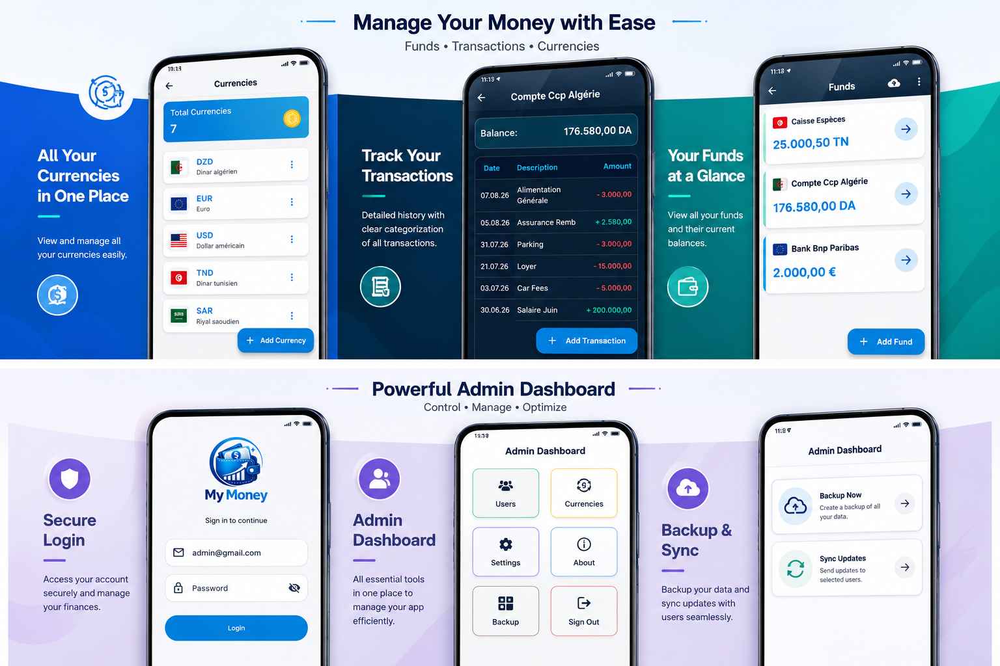

# My Money 💰

A personal money management application built with Flutter, designed with an
offline-first approach for managing funds, currencies, transactions, and users.

## ✨ Features

- 💰 Funds & balance management
- 💱 Multi-currency support
- 🧾 Transaction history
- 👥 Admin / Viewer roles
- 🔄 JSON-based user data updates
- 📦 Offline-first local database

## 🛠️ Technologies & Skills

- **Flutter & Dart**
- **SQLite** — Local data storage
- **Cubit / BLoC** — State management
- **Supabase Authentication** — User authentication
- **Supabase Storage** — Secure update file delivery
- **SharedPreferences** — Local preferences & settings
- **JSON** — Data synchronization between Admin and Viewer
- **Repository Pattern** — Separation of data access logic
- **SQLite Transactions & Triggers** — Data integrity & balance management
- **Git & GitHub** — Version control

## 📱 Screenshots

<!-- Add your application screenshots here -->

   

## 👨‍💻 About

My Money is a personal Flutter project focused on building a reliable,
offline-first financial management application with local data persistence,
role-based access, and a lightweight update mechanism.

---

**Developed with Flutter & Dart ❤️**